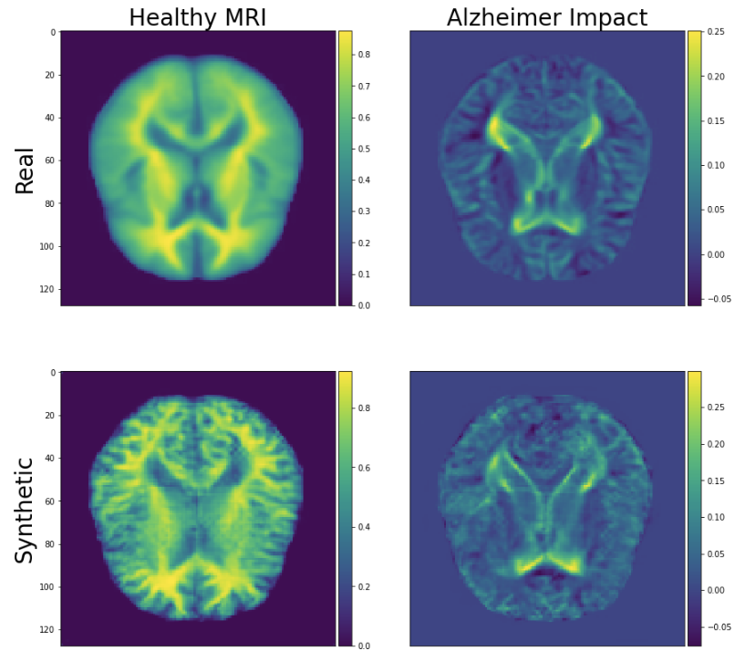
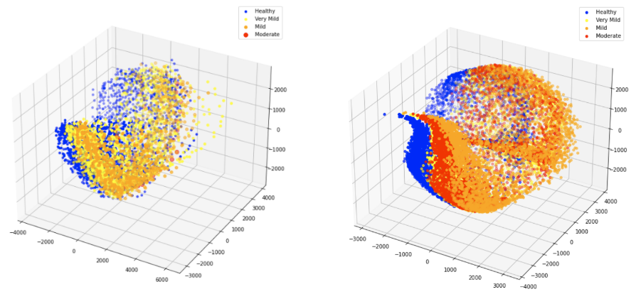
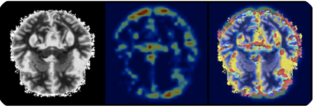

# Analysis on Synthetic Alzheimers MRIs   
### For the Biolib Synthetic Health Data hackathon 2020  

The Alzheimers challenge provided the participants with:  
An imbalanced dataset of Real Alzheimers MRIs and  
A balanced dataset of Synthetic Alzheimers MRIs generated by cGANs    

### We analyzed the impact of Alzheimers disease on the real and synthetic dataset:  
    
### We compared the dataset distributions:  
    

### After analyzing and training on the ensamble dataset we applied Grad-Cam algorithm:  
Showing the activations of early convolutional (Alexnet) layers for a moderate Alzheimers case:  
  

### Team Members
- Mihalis Gongolidis
- Electra Zarafeta
